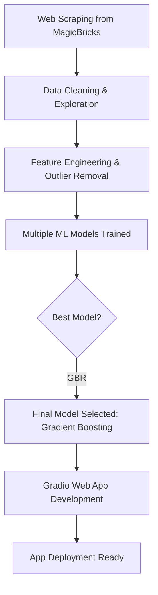

## Bangalore Rental Price Prediction

This project predicts monthly rental prices in Bangalore using machine learning. It includes end-to-end development: from **web scraping over 3,500 listings** to **data preprocessing**, **model comparison**, and a **Gradio web app** using the best-performing model.

---

## Overview

-  **Problem Statement:** Predict the rent of residential properties in Bangalore based on features like area, location, furnishing type, and more.
-  **Data Source:** Custom web scraping from [MagicBricks.com](https://www.magicbricks.com/) — over 3,500 listings scraped.
- ⚙ **Tech Stack:** Python, Pandas, Scikit-learn, Gradio, BeautifulSoup, Streamlit (initially).
-  **ML Models Tried:**
  - Linear Regression
  - Support Vector Regression (SVR)
  - Random Forest Regressor
  - Gradient Boosting Regressor ✅ *(Best Performing)*

---

## Project Flow


---

---

## 📁 Project Structure

```
rental-price-prediction/
├── data/
│   ├── bangalore_rent_data_advanced.csv
│   ├── bangalore_rent_data_final.csv
│   └── bangalore_rent_data_model_ready.csv
│
├── notebooks/
│   ├── 1.1_Data_Collection.ipynb
│   ├── 1.2_Data_Cleaning_Exploration.ipynb
│   ├── 1.3_Model_Preparation_Training.ipynb
│   └── 1.4_Model_Improvement_Feature_Engineering.ipynb
│
├── rental_price_app/
│   ├── app.py
│   ├── gradient_boosting_model
│   ├── sample_input_data.csv
│   └── feature_columns.pkl
│
├── README.md
└── requirements.txt
```


